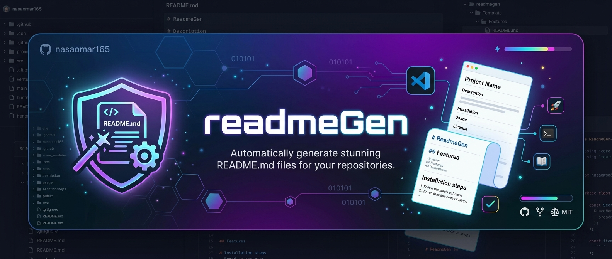

# 🤖 readmeGen

> AI-powered README generator — scan any repo, get professional documentation instantly.


**Zero pip dependencies · Pure Python stdlib · 7 AI providers · Security hardened**



---
## ✨ Features

- 🔍 **Deep repo scanning** — reads file tree, source, configs, manifests; smart file prioritization
- 🧠 **Understands your stack** — generates contextual, accurate documentation
- 🌐 **7 AI providers** — 5 cloud free tiers + 2 fully local options
- ⚙️ **GitHub Actions** — one command to wire up auto-regeneration on every push
- 🔒 **Security hardened** — SSRF prevention, path traversal blocking, symlink guards, sensitive file detection with glob patterns, API key redaction, TLS certificate enforcement
- 🏗️ **Provider abstraction** — clean OOP architecture; adding a new backend takes one class
- 🔁 **Exponential backoff** — automatic retry on rate limits and transient network errors
- 🛡️ **Secret masking in dry-run** — never leaks env values in prompt previews
- 📦 **Zero dependencies** — pure Python stdlib, works anywhere Python 3.8+ is installed
- 🎛️ **Power-user controls** — `--verbose`, `--stdout`, `--max-files`, `--max-total-chars`, `--max-file-size`

---

## 🌐 Supported AI Providers

| Provider     | Env Variable         | Free? | Default Model         | Get Key |
|--------------|----------------------|-------|-----------------------|---------|
| **groq**     | `GROQ_API_KEY`       | ✅    | llama3-70b-8192       | [console.groq.com](https://console.groq.com) |
| **gemini**   | `GEMINI_API_KEY`     | ✅    | gemini-1.5-flash      | [aistudio.google.com](https://aistudio.google.com/app/apikey) |
| **deepseek** | `DEEPSEEK_API_KEY`   | ✅    | deepseek-chat         | [platform.deepseek.com](https://platform.deepseek.com) |
| **kimi**     | `KIMI_API_KEY`       | ✅    | moonshot-v1-8k        | [platform.moonshot.cn](https://platform.moonshot.cn) |
| **glm**      | `GLM_API_KEY`        | ✅    | glm-4-flash           | [open.bigmodel.cn](https://open.bigmodel.cn) |
| **ollama**   | *(none)*             | ✅    | llama3                | [ollama.com](https://ollama.com) |
| **lmstudio** | *(none)*             | ✅    | *(your loaded model)* | [lmstudio.ai](https://lmstudio.ai) |

**Auto-detection order:** groq → gemini → deepseek → kimi → glm → lmstudio → ollama

---

## 🚀 Quick Start

```bash
# 1. Download (no install needed)
curl -O https://raw.githubusercontent.com/nasaomar165/readmegen/main/readmegen.py

# 2. Set a free API key
export GROQ_API_KEY=your_key_here

# 3. Run on your project
python readmegen.py /path/to/your/repo
```

---

## 📖 Usage

```bash
# Auto-detect provider, current directory
python readmegen.py

# Specific repo path
python readmegen.py ./my-project

# Choose a cloud provider
python readmegen.py --provider groq
python readmegen.py --provider deepseek
python readmegen.py --provider kimi
python readmegen.py --provider glm
python readmegen.py --provider gemini

# Local models — no API key needed
python readmegen.py --provider ollama
python readmegen.py --provider ollama --model mistral
python readmegen.py --provider lmstudio
python readmegen.py --provider lmstudio --base-url http://192.168.1.5:1234

# Output options
python readmegen.py --output docs/README.md    # custom file path
python readmegen.py --stdout                   # print to terminal, no file written
python readmegen.py --overwrite                # skip confirmation prompt

# Debugging & inspection
python readmegen.py --dry-run                  # prompt preview (secrets masked)
python readmegen.py --dry-run --verbose        # preview + token estimate + per-file stats
python readmegen.py --list-providers           # show all providers

# Fine-grained scan control
python readmegen.py --max-files 100
python readmegen.py --max-total-chars 160000
python readmegen.py --max-file-size 25000
python readmegen.py --max-files 100 --max-total-chars 160000 --verbose

# GitHub Actions
python readmegen.py --gen-workflow groq                 # print YAML to stdout
python readmegen.py --gen-workflow groq --save-workflow # save to .github/workflows/readme.yml
```

---

## ⚙️ GitHub Actions — Auto-regenerate README on push

One command wires readmegen into your CI:

```bash
python readmegen.py --gen-workflow groq --save-workflow
```

This creates `.github/workflows/readme.yml`. On every push to `main`, GitHub Actions will:

1. Check out the repository
2. Run `readmegen` with your chosen provider
3. Commit and push the updated `README.md` automatically

**Setup:**
1. Go to **Settings → Secrets and variables → Actions**
2. Add the secret for your provider (e.g. `GROQ_API_KEY`)
3. Push — runs on every subsequent commit

> ⚠️ Local providers (Ollama, LM Studio) cannot run in GitHub Actions. Use any cloud provider instead.

---

## 🔒 Security

All protections run automatically — no configuration required.

### SEC-1 — SSRF & URL Scheme Validation
`--base-url` and all provider URLs are validated before any network call. Only `http://` and `https://` schemes are accepted. `file://`, `ftp://`, `javascript:`, `data:` and all others are rejected. Cloud providers additionally require HTTPS.

```
❌  --base-url file:///etc/passwd     blocked (disallowed scheme)
❌  --base-url ftp://evil.com         blocked (disallowed scheme)
❌  --base-url http://api.groq.com    blocked (cloud requires HTTPS)
✅  --base-url https://api.groq.com   allowed
✅  --base-url http://localhost:11434  allowed (local)
```

### SEC-2 — Output Path Traversal Prevention
`--output` paths are resolved and verified to stay inside the repository root before any write occurs.

```
❌  --output ../../etc/crontab   blocked (escapes root)
❌  --output /etc/passwd         blocked (absolute path outside root)
✅  --output docs/README.md      allowed
```

### SEC-3 — Symlink Escape & Sensitive File Blocking
Every file discovered by `rglob("*")` has its symlink-resolved real path checked to confirm it stays inside the repository root. Files that commonly hold secrets are blocked via both an **exact name set** and **fnmatch glob patterns** — case-insensitively:

| Type | Examples |
|------|---------|
| Exact names | `.env`, `id_rsa`, `id_ed25519`, `.netrc`, `auth.json`, … |
| Glob: crypto files | `*.pem`, `*.key`, `*.crt`, `*.p12`, `*.pfx` |
| Glob: secrets files | `secrets.*`, `credentials.*`, `password.*` |
| Glob: env variants | `.env.*` (`.env.local`, `.env.production`, …) |

Skipped files are counted and reported — never silently dropped.

### SEC-4 — Secret Masking & Key Redaction
`--dry-run` automatically applies regex masking before displaying any prompt output, replacing assignments like `API_KEY=abc123` with `API_KEY=[REDACTED]`. API keys are also never printed in full — only the first and last 4 characters are shown:

```
🔑 API key: sk-a…cdef
```

### SEC-5 — Specific Exception Handling
All file-read errors are caught as `OSError` (not a bare `except`) and printed to stderr, so permission errors and broken symlinks are visible instead of silently swallowed.

### SEC-6 — TLS Certificate Verification
Every outbound request explicitly uses `ssl.create_default_context()`. There is no `ssl.CERT_NONE` or certificate verification bypass anywhere in the codebase.

---

## 🏗️ Architecture

### Provider Abstraction (v0.2.2)

Providers are now a clean class hierarchy. Adding a new AI backend means writing one class:

```
BaseProvider  (abc.ABC)
├── OpenAICompatProvider   ← Groq, DeepSeek, Kimi, GLM, LM Studio
├── GeminiProvider         ← Google Gemini
└── OllamaProvider         ← Ollama local server
```

### Exponential Backoff Retry (v0.2.2)

Transient failures (HTTP 429, 500–504, network errors) are retried automatically:

```
Attempt 1 fails → wait 1s → Attempt 2 fails → wait 2s → Attempt 3 fails → wait 4s → raise
```

### How a scan works

```
Your repo
    │
    ▼
Scan recursively (rglob)
    │  skip dirs:  node_modules, .git, __pycache__, dist, venv, ...
    │  skip files: *.pyc, *.lock, .DS_Store, ...
    │  skip:       symlinks escaping root
    │  skip:       .env, *.key, secrets.*, credentials.*, *.pem, ...
    │  prioritize: package.json, main.py, go.mod, Dockerfile, ...
    │  caps:       --max-files (50)  ·  --max-total-chars (80,000)
    │              --max-file-size (15,000 per file)
    ▼
Validate security constraints
    │  --output path stays inside repo root        [SEC-2]
    │  --base-url uses http/https only             [SEC-1]
    ▼
Build structured prompt
    │  directory tree + file contents
    │  --dry-run: mask secrets before display      [SEC-4]
    ▼
Call AI provider (with retry)
    │  cloud (HTTPS + cert verification):  Groq, Gemini, DeepSeek, Kimi, GLM
    │  local:                              Ollama, LM Studio
    ▼
Write README.md  (or --stdout)
    │  path traversal check before write           [SEC-2]
    ▼
Optional: GitHub Actions commits README on every push
```

---

## 🛠️ Configuration Reference

| Flag                  | Default   | Description |
|-----------------------|-----------|-------------|
| `--provider`          | auto      | AI provider to use |
| `--model`             | per-provider | Override model name |
| `--base-url`          | per-provider | Override API endpoint URL |
| `--output`            | `README.md` | Output file path |
| `--stdout`            | off       | Print to terminal instead of file |
| `--overwrite`         | off       | Skip overwrite confirmation |
| `--dry-run`           | off       | Preview prompt, no AI call |
| `--verbose`           | off       | Per-file scan stats + token estimate |
| `--max-files`         | 50        | Maximum files to read |
| `--max-total-chars`   | 80,000    | Total character cap for prompt |
| `--max-file-size`     | 15,000    | Per-file character cap |
| `--gen-workflow`      | —         | Print GitHub Actions YAML for a provider |
| `--save-workflow`     | off       | Save workflow (use with `--gen-workflow`) |
| `--list-providers`    | —         | Show all providers and exit |
| `--version`           | —         | Print version and exit |

| Env Variable        | Provider |
|---------------------|----------|
| `GROQ_API_KEY`      | Groq |
| `GEMINI_API_KEY`    | Google Gemini |
| `DEEPSEEK_API_KEY`  | DeepSeek |
| `KIMI_API_KEY`      | Kimi (Moonshot) |
| `GLM_API_KEY`       | Zhipu GLM |

---

## 🔧 Install as a global CLI (optional)

```bash
pip install -e .
# Use from anywhere:
readmegen ./my-project
readmegen --provider deepseek --verbose ./my-project
```

---

## 📋 Project Structure

```
readmegen/
├── readmegen.py               # entire tool — single file, zero deps
├── pyproject.toml             # optional: install as 'readmegen' CLI
├── README.md                  # this file
└── .github/
    └── workflows/
        └── readme.yml         # example GitHub Actions workflow
```

---

## 🗂️ Changelog

### v0.2.2 — Architecture & UX improvements
- **Provider abstraction**: `BaseProvider` ABC with `OpenAICompatProvider`, `GeminiProvider`, `OllamaProvider` — adding a backend now takes one class
- **Exponential backoff retry**: automatic retry on HTTP 429/5xx and network errors (1s → 2s → 4s)
- **Token estimation**: `--verbose` shows `~N tokens` and warns if the model context window may be exceeded
- **Secret masking in dry-run**: `API_KEY=abc123` → `API_KEY=[REDACTED]` before any display
- **Expanded sensitive file detection**: added `*.pem`, `*.key`, `*.crt`, `secrets.*`, `credentials.*`, `password.*`, `.env.*` glob patterns — with precision tuning to avoid false positives on source files
- **Case-insensitive ignore matching**: `fnmatch` against lowercased names — works identically on Windows, macOS, Linux
- **Fixed directory-ignore patterns**: `fnmatch` applied to every path component, so `foo.egg-info`, `.tox` etc. are now reliably skipped
- **ASCII art banner**: colorful intro on normal runs; suppressed for `--help`, `--list-providers`, `--gen-workflow`
- **New CLI flags**: `--verbose`, `--stdout`, `--max-files`, `--max-total-chars`, `--max-file-size`
- **Better error messages**: specific exception types with actionable hints per provider
- **Full type annotations** on all functions and methods

### v0.2.1 — Security hardening
- SEC-1: SSRF / URL scheme validation
- SEC-2: Output path traversal prevention
- SEC-3: Symlink escape guard + sensitive file blocklist
- SEC-4: API key redaction in all output
- SEC-5: Replaced bare `except` with `OSError`
- SEC-6: Explicit TLS certificate verification

### v0.2.0 — New providers & GitHub Actions
- Added DeepSeek, Kimi (Moonshot), GLM (Zhipu), LM Studio
- `--gen-workflow` / `--save-workflow` for GitHub Actions
- `--list-providers`, `--base-url`, `--version` flags
- Auto-detection order with LM Studio probe

### v0.1.0 — Initial release
- Groq, Google Gemini, Ollama
- Repo scanning with smart file prioritization
- Single-file, zero-dependency design

---

## 🤝 Contributing

1. Fork the repository
2. Make changes to `readmegen.py`
3. Test: `python readmegen.py --dry-run --verbose .`
4. Open a pull request

**Please keep the zero-dependency constraint** — stdlib only, no `pip install`.

---

## 📄 License

MIT
